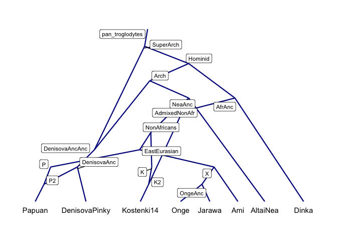
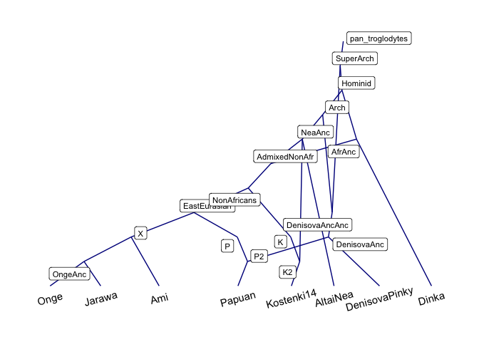
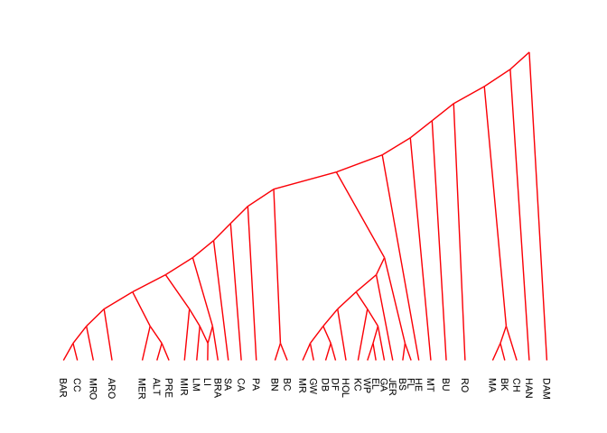
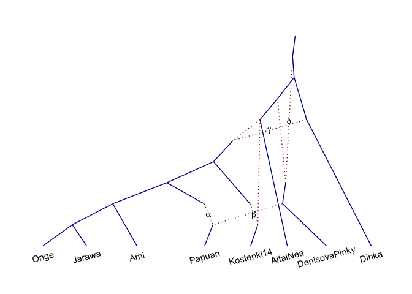
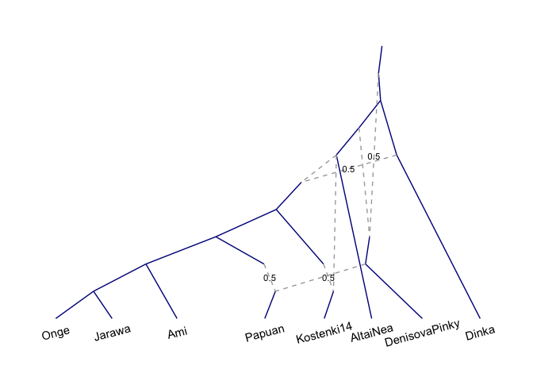

<!-- README.md is generated from README.Rmd. Please edit that file -->

# adrift – Modelling drift on admixture graphs

[](https://www.gnu.org/licenses/gpl-3.0.en.html)
[](https://www.tidyverse.org/lifecycle/#experimental)
[](http://www.repostatus.org/#active)
[](/commits/master)
[](commits/master)
[](https://travis-ci.org/mailund/adrift)
[](https://ci.appveyor.com/project/mailund/adrift)
[](https://codecov.io/github/mailund/adrift?branch=master)
[](https://coveralls.io/github/mailund/adrift?branch=master)
[](https://cran.r-project.org/package=adrift)
[](https://cran.r-project.org/package=adrift)
[](https://cran.r-project.org/)

The goal of `adrift` is to have an improved `admixturegraph` package
with better visualisation of graphs and graph statistics.

## Installation

You can install the released version of adrift from
[CRAN](https://CRAN.R-project.org) with:

``` r
install.packages("adrift")
```

And the development version from [GitHub](https://github.com/) with:

``` r
# install.packages("devtools")
devtools::install_github("mailund/adrift")
```

## Example

``` r
library(magrittr)
library(adrift)
#> Loading required package: Rcpp

graph <- parse_dot(readr::read_file("data-raw/Basic_OngeEA_wArch.dot"))
graph %>% 
    make_graph_plot() %>%
    show_leaf_labels(nudge_y = -0.5) %>%
    show_inner_node_labels()
```



``` r
library(magrittr)
library(adrift)

graph <- parse_qpgraph(readr::read_file("data-raw/Basic_OngeEA_wArch.graph"))
graph %>% 
    make_graph_plot(edge_colour = "darkblue") %>%
    show_leaf_labels(nudge_y = -0.5, angle = 15) %>%
    show_inner_node_labels()
```



``` r
graph <- parse_dot(readr::read_file("data-raw/BosGraph.dot"))
graph %>% 
    make_graph_plot(edge_colour = "red") %>%
    show_leaf_labels(angle = -90, size = 2.8, nudge_y = -1, hjust = 0)
```



``` r
graph <- parse_qpgraph(readr::read_file("data-raw/Basic_OngeEA_wArch.graph"))
plt <- graph %>%
    make_graph_plot(
        ggplot2::aes(filter = !admixed),
        edge_colour = "darkblue"
    ) %>%
    show_leaf_labels(nudge_y = -0.5, angle = 15)

admixture_vars <- c(
    "P_P2" = "alpha",
    "K_K2" = "beta",
    "AfrAnc_AdmixedNonAfr" = "gamma",
    "SuperArch_DenisovaAncAnc" = "delta"
)
plt %>% add_admixture_labels(
    admixture_vars,
    linetype = "dotted",
    colour = "darkred"
)
```



``` r

plt %>% add_admixture_labels(
    attr(graph, "admixture_proportions"),
    label_size = 3,
    linetype = "dashed",
    colour = "darkgray"
)
```


