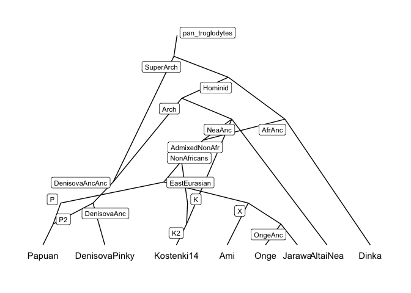

<!-- README.md is generated from README.Rmd. Please edit that file -->

# adrift – Modelling drift on admixture graphs

[](https://travis-ci.org/mailund/adrift)

The goal of `adrift` is to have an improved `admixturegraph` package
with better visualisation of graphs and graph statistics.

## Installation

You can install the released version of adrift from
[CRAN](https://CRAN.R-project.org) with:

``` r
install.packages("adrift")
```

And the development version from [GitHub](https://github.com/) with:

``` r
# install.packages("devtools")
devtools::install_github("mailund/adrift")
```

## Example

``` r
library(ggplot2)
library(tidygraph)
#> 
#> Attaching package: 'tidygraph'
#> The following object is masked from 'package:stats':
#> 
#>     filter
library(ggraph)
library(matchbox)
library(adrift)
#> Loading required package: dplyr
#> 
#> Attaching package: 'dplyr'
#> The following object is masked from 'package:ggplot2':
#> 
#>     vars
#> The following objects are masked from 'package:stats':
#> 
#>     filter, lag
#> The following objects are masked from 'package:base':
#> 
#>     intersect, setdiff, setequal, union
#> Loading required package: pmatch
#> Loading required package: tailr
#> Loading required package: minilexer
#> Loading required package: Rcpp

ag_layout <- function(graph, circular, ...) {
    g$layout()
    cbind(g$node_positions %>% select(x, y),
          graph, circular = NA)
}

g <- new(Graph)
edges <- read_dot(readr::read_file("data-raw/Basic_OngeEA_wArch.dot"))
from_nodes <- edges[,"parent"]
to_nodes <- edges[,"child"]
nodes <- c(from_nodes, to_nodes) %>% unique()
for (n in nodes) g$add_node(n)
for (i in seq_along(edges[,"parent"])) {
    g$connect_nodes(edges[i,"parent"], edges[i,"child"])
}

graph <- tbl_graph(nodes = g$ggraph_nodes,
                   edges = g$ggraph_edges)
graph %>%
    ggraph(ag_layout) +
    geom_edge_link(edge_width = 0.8, edge_colour = "darkblue") +
    geom_node_text(aes(filter = is_leaf, label = label),
                   size = 4, nudge_y = -0.4, angle = -10) +
    geom_node_label(aes(filter = !is_leaf, label = label),
                    size = 3, nudge_y = -0.1, repel = TRUE) +
    coord_cartesian(clip = "off") +
    theme_graph()
```


